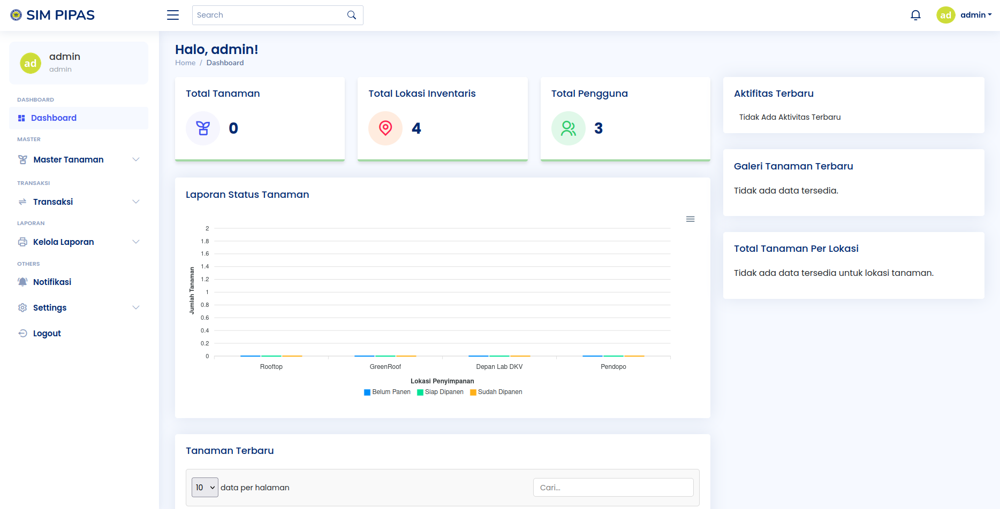
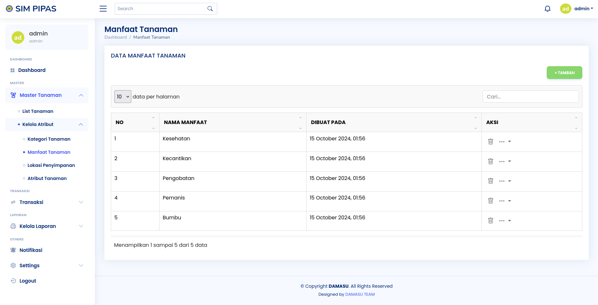

# PIPAS Inventaris Tanaman

## Paduan Installasi Project

1. Buka folder yang akan diisi proyek.
2. Buka Git Bash atau Command Prompt (cmd), lalu ketik git clone <URL Proyek>.
3. Tunggu hingga proses download selesai.
4. Pindah ke folder proyek dengan cd <nama_projek>.
5. Ketika selesai, masukan .env kedalam folder projek tersebut (Jika tidak ada)
    COPY PASTE .ENV : https://pastebin.com/tK0yvPx4
6. Jangan lupa untuk mengetik composer update, lalu composer install (buat laravel)
7. lalu ketik command di terminal "php artisan migrate:fresh --seed"
8. setelah itu bisa di jalankan dengan command "php artisan serve"

## Penggunaan Website PIPAS Inventaris Tanaman

### Sebagai role User (siswa)

### Sebagai role Admin

### Sebagai role Master
